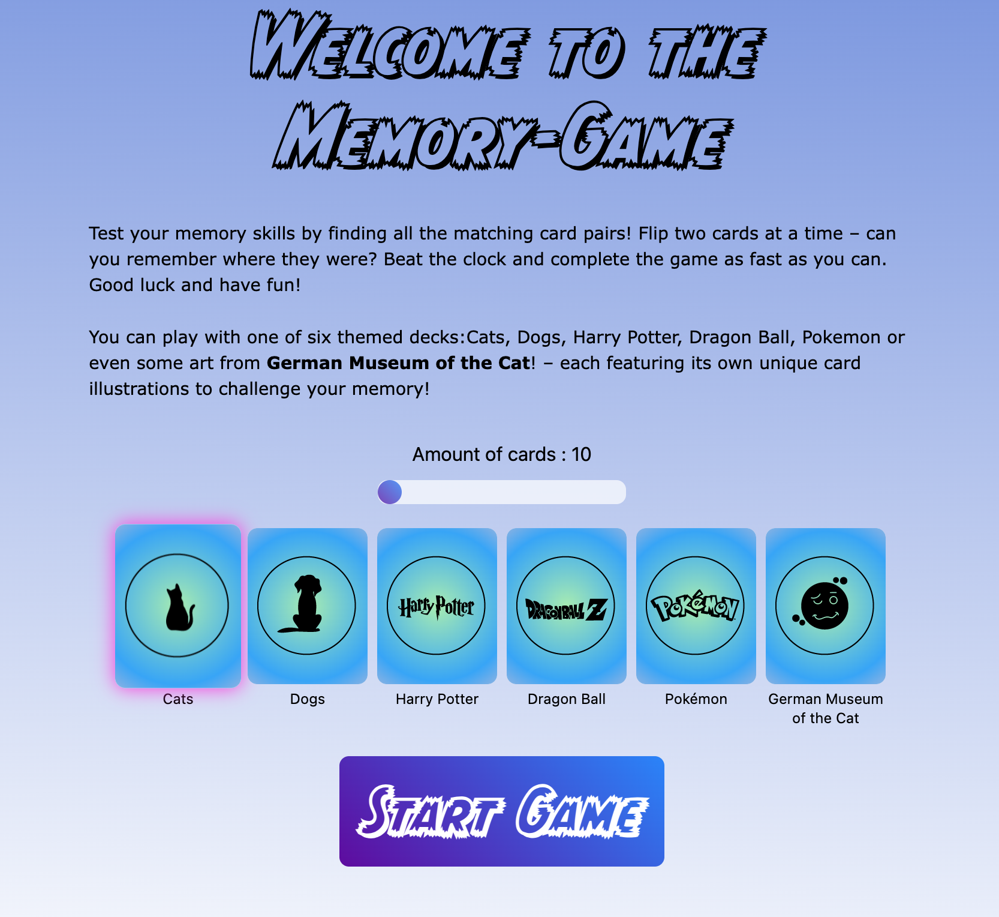

# Memory-Game 
DCI Project March 2025

Members of the crew are:  
@SarahDomscheit  
@benNurtjipta  
@cmgoersch  

This project is already under construction. :)

## Project Description
The Memory Game is a classic card-matching game designed to test and improve memory skills. Players flip over pairs of cards, trying to find matching pairs. The game is complete when all pairs are matched. This project is built as part of the DCI curriculum to practice programming concepts and enhance problem-solving skills.

